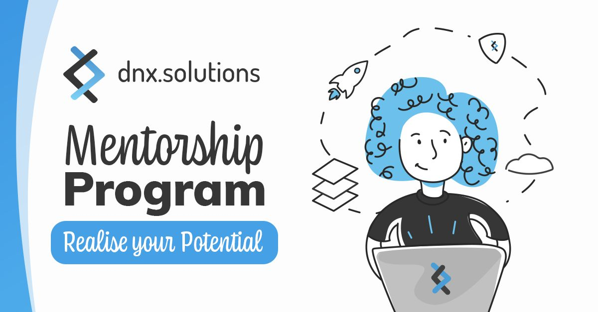

- ## [1. Running Laravel Application](./docs/1.laravel.md)
    How to get the application up and running in your local machine
- ## [2. First Challenge](./docs/2.first_challenge.md)
    Let's have some fun