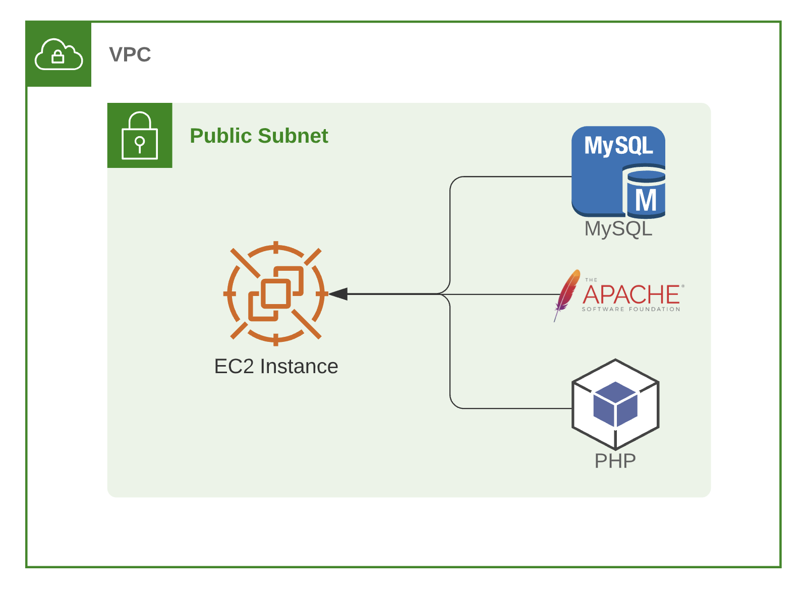

## First Challenge

Hello, welcome to our first challenge.\
Let's start small, deploying this application on an EC2, with a MySQL installed and running inside the instance.\
You will need to create and present to us in our next session, the following infrastructure up and running + the application working there.

### Below, the list of the things to create:

|  | Task |
|------|-------------|
|1|Create an AWS VPC|
|2|Create an Ubuntu Server using AWS EC2|
|3|Install All the necessary dependencies in the EC2:   Apache, MySQL, PHP, PHP extensions, Composer and etc.|
|4|Deploy and config the application into the EC2|
|5|Be prepared to show us your work next week :)|
