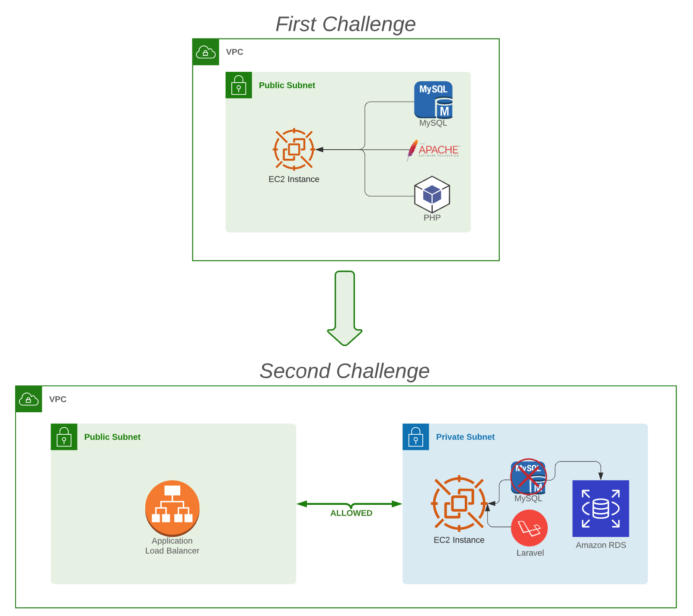

## Second Challenge

Let's start decoupling our architecture.\
In the first challenge, we created and deployed our application using an EC2.\
In this session, we've learnt a bit about ALB and RDS and in the next challenge, we will be making use of these resources.

### Below, a summary of your next tasks:

|  | Task |
|------|-------------|
|1|Create a Private Subnet in your VPC |
|2|Create a new Ubuntu Server using EC2 in the private Subnet |
|3|Create an RDS for MySQL also in the private Subnet |
|4|Create an Application Load Balancer in the public Subnet|
|5|Install All the necessary dependencies in the EC2, and deploy your laravel application. However, your MySQL will be now in RDS instead of installed in the EC2.|
|6|To access your application, we should go now through the ALB.|
|7|See you next session :)|
