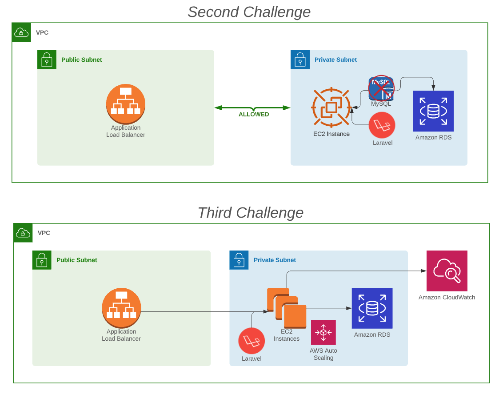

## Third Challenge

Let's start auto scaling our architecture.\
In this session, we've learnt a bit about Auto Scaling and CloudWatch. \
In the next challenge, we will be making use of these resources. \
Now, we will not create our instances manually, but using Auto Scaling. \
In this challenge, you will also need to create a Cloud Watch group, and send your Apache logs to it.

### Below, a summary of your next tasks:

|  | Task |
|------|-------------|
|1|Create a CloudWatch Log Group|
|2|Create a Launch Configuration.   This will be your instance configuration template and is used to launch your EC2 instances.   You will need a new Load Balancer here, pointing it to use the target group created in the Launch Config.   <b>Tip</b>: In this Launch Configuration you will be able to config your Cloud Watch Agent. |
|3|Create an Auto Scaling making use of the Launch Configuration above. |
|4|See you next session :)|
