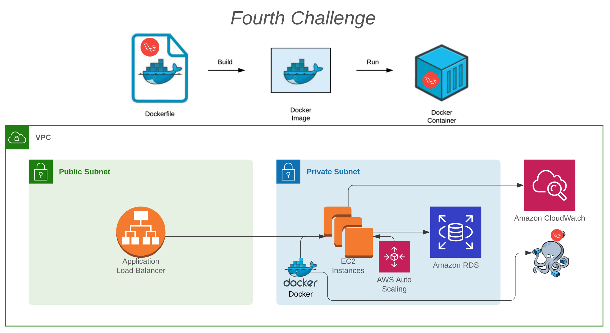

## Fourth Challenge

Let's start containerizing our architecture.\
Last session, we've learnt a bit about Docker and docker-compose. \
In the next challenge, we will be making use of these resources. \
Now, we will not config our application directly in the EC2. \
In this challenge, you will need to create a Dockerfile responsible to automatise all the EC2 configuration process, and you should run your application by using docker-compose.

### Below, a summary of your next tasks:

|  | Task |
|------|-------------|
|1| Create a Dockerfile based in PHP.   Here is where you will have apache and all your stuff installed previously in the EC2. |
|2| Create a docker-compose.yml, adding a service that will be responsible to build your Dockerfile. |
|3| Build your image, and get your docker container up and running by using docker-compose. |
|4| See you next session :)|
