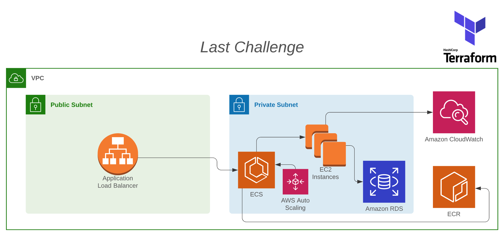

## Last Challenge

Hi there! We are reaching the end of our mentoring.\
The last challenge will include the ECR and ECS resources we've learnt in the last session. \
Also, we will start using infra as code, and our infra should be now created with terraform.

### Below, is a summary of your next tasks:

|  | Task |
|------|-------------|
|1| If not already there, move your infra resources to terraform |
|2| Include an ECR and an ECS in your terraform code |
|3| Make the necessary changes in your Load Balancer and Auto Scaling |
|4| Your ECS app will use your Docker image to provision your EC2 instances, and for that, your image should be availble in ECR |
|5| See you next session :)|
